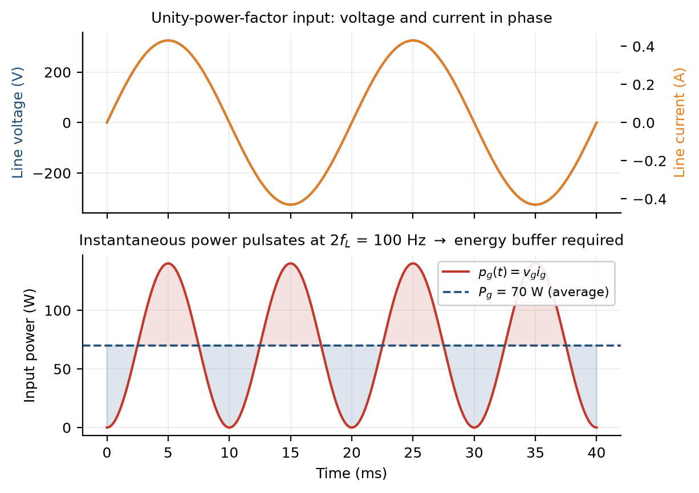
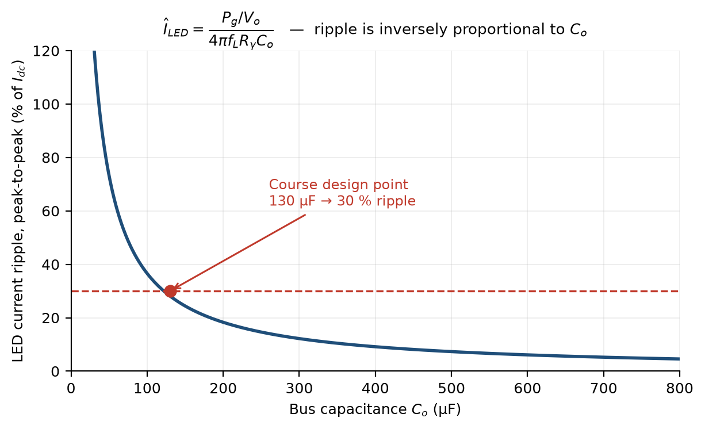
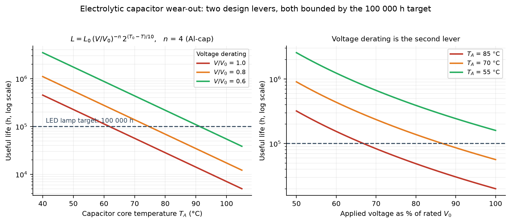
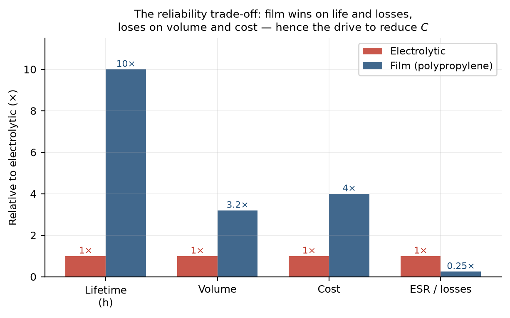
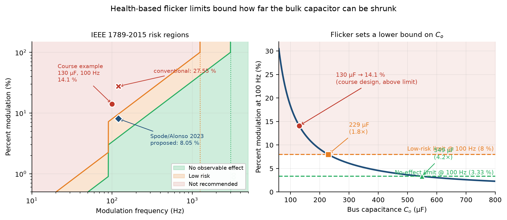
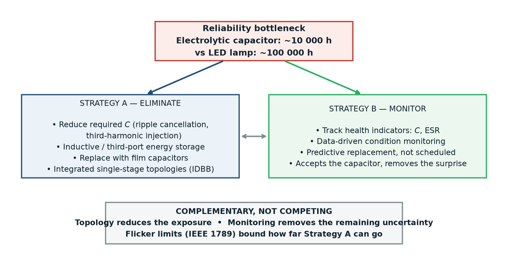

# LED driver flicker vs bulk capacitance

Figure generation and supporting calculations for the course report
***Reliability of Off-Line LED Drivers: Eliminating or Monitoring the Electrolytic Capacitor?***

Written for *Introduction to LED Lighting*, taught by Prof. J. Marcos Alonso Alvarez.

Christian E. Bamogo — Harbin Institute of Technology

---

## What this repository contains

Every figure in the report is generated by `figures.py` from two sources only:

1. the design equations of the course notes, applied to the worked example of Module 4;
2. the percent-modulation boundaries of IEEE Std 1789-2015.

No data is fitted, measured or simulated. Each number quoted in the report is a direct
evaluation of a closed-form expression, and the script prints them at the end of a run
so they can be checked against the text.

```
figures.py          all six figures + the three key numerical results
figures/            generated PNGs
requirements.txt    numpy, matplotlib
```

## Reproducing

```bash
pip install -r requirements.txt
python figures.py
```

Expected console output:

```
Key numerical results reported in the paper
----------------------------------------------------
  Course design, Co = 130 uF   -> %Mod =  14.1 %  at 100 Hz
  IEEE 1789 low risk               ( 8.00 %) -> Co =   229 uF  (1.8x)
  IEEE 1789 no observable effect   ( 3.33 %) -> Co =   549 uF  (4.2x)
```

## Case study parameters

Taken from the single-stage buck-boost example of the course notes, Module 4:

| Parameter | Symbol | Value |
|---|---|---|
| Mains voltage / frequency | `Vg`, `fL` | 230 V, 50 Hz |
| Output ripple frequency | `2·fL` | 100 Hz |
| Lamp power | `Pg` | 70 W |
| LED string voltage / current | `Vo`, `Idc` | 200 V, 0.35 A |
| LED threshold voltage | `Vγ` | 170 V |
| LED dynamic resistance | `Rγ` | 87 Ω |

## Equations used

**Pulsating input power under unity power factor**

$$p_g(t) = \hat{V}_g \hat{I}_g \sin^2(\omega_L t) = P_g\left[1 - \cos(2\omega_L t)\right]$$

**LED current ripple as a function of the bus capacitance** (course notes, Module 4)

$$\hat{I}_{LED} = \frac{P_g / V_o}{4\pi f_L R_\gamma C_o}
\qquad\Longrightarrow\qquad
C_o = \frac{P_g / V_o}{4\pi f_L R_\gamma \hat{I}_{LED}}$$

**Capacitor lifetime model** (Wang & Blaabjerg, *IEEE Trans. Ind. Appl.* 50(5), 2014)

$$L = L_0 \left(\frac{V}{V_0}\right)^{-n} 2^{(T_0 - T)/10}, \qquad n \approx 3\text{–}5 \text{ for Al-caps}$$

**IEEE 1789-2015 percent modulation and boundaries**

$$\%\mathrm{Mod} = 100 \cdot \frac{Max - Min}{Max + Min}$$

| Region | f < 90 Hz | 90 Hz ≤ f |
|---|---|---|
| Low risk | 0.025·f | 0.080·f (up to 1250 Hz) |
| No observable effect | 0.010·f | 0.0333·f (up to 3000 Hz) |

At 100 Hz this gives 8 % and 3.33 % respectively.

## Main result

Applying the ripple equation to the course design example gives 14.1 % modulation at
100 Hz for the 130 µF bus capacitor, which lies above the IEEE 1789 low-risk boundary.
Inverting the equation for the two limits gives **229 µF** for low risk and **549 µF**
for no observable effect — 1.8× and 4.2× the original value.

The point of the report is that this lower bound on the bulk capacitance originates in a
health recommendation rather than in the electronics, and that it therefore limits how far
capacitor-elimination strategies can be taken.

## Figures

### Fig. 1 — Pulsating input power


### Fig. 2 — Required capacitance vs ripple


### Fig. 3 — Electrolytic capacitor wear-out


### Fig. 4 — Electrolytic vs film


### Fig. 5 — IEEE 1789 limits vs bulk capacitance *(key figure)*


### Fig. 6 — Eliminate vs monitor


## References

1. S. Li, S.-C. Tan, C. K. Lee, E. Waffenschmidt, S. Y. R. Hui, C. K. Tse, "A Survey, Classification, and Critical Review of Light-Emitting Diode Drivers," *IEEE Trans. Power Electron.*, 31(2), 1503–1516, 2016.
2. H. Wang, F. Blaabjerg, "Reliability of Capacitors for DC-Link Applications in Power Electronic Converters — An Overview," *IEEE Trans. Ind. Appl.*, 50(5), 3569–3578, 2014.
3. N. Spode, M. A. Dalla Costa, G. Z. Abdelmessih, J. M. Alonso, R. R. Duarte, "Reducing Low-Frequency Ripple Using Alternative Output Capacitor Connection on Integrated Converters for LED Drivers," *IEEE Trans. Ind. Appl.*, 59(4), 5158–5168, 2023.
4. IEEE Std 1789-2015, *Recommended Practices for Modulating Current in High-Brightness LEDs for Mitigating Health Risks to Viewers*.

## Note

The design example is used exactly as presented in the course notes, where it illustrates
the ripple calculation. It is not a product specification, and the comparison against
IEEE 1789 is made here to show that the ripple target is externally constrained — not to
suggest an error in the example.

## License

MIT
